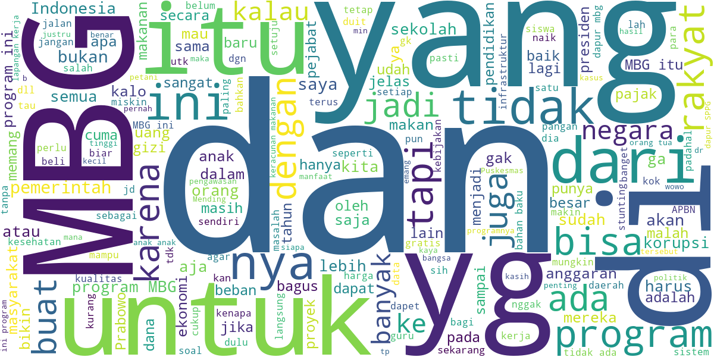
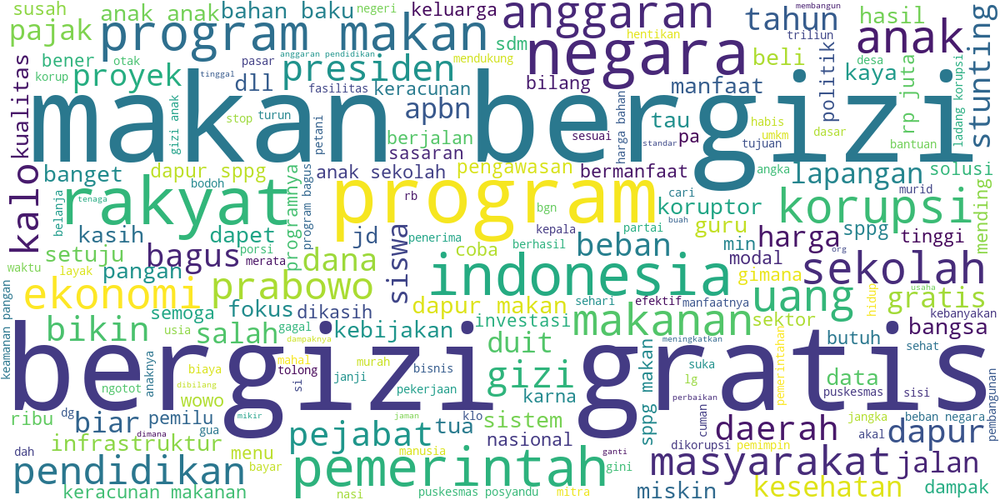

# Tubes DIP – Pipeline Preprocessing Komentar YouTube MBG

Repo ini menyediakan pipeline end-to-end untuk mengambil komentar YouTube terkait program Makan Bergizi Gratis (MBG), membersihkan teks, menormalisasi bahasa gaul, lalu menyiapkan dataset yang siap dipakai untuk analisis NLP/ML.

Notebook utama: `scripts/scraping_komentar_youtube_mbg_fixed (1).ipynb`.

## Tujuan & Kegunaan Program
Program ini membangun **pipeline preprocessing otomatis** untuk komentar YouTube agar teks mentah yang penuh singkatan, typo, dan bahasa gaul menjadi teks bersih dan lebih baku. Hasil akhirnya dapat digunakan untuk:
- Analisis opini publik tentang MBG (sentimen, topik dominan, pola keluhan/dukungan).
- Pembuatan dataset terstruktur untuk eksperimen NLP/ML.
- Reproduksi riset karena proses pembersihan, normalisasi, dan pelabelan terdokumentasi.

## Ringkasan Pipeline
1. **Akuisisi data**: Mengambil komentar (top-level dan reply) dari video YouTube tertentu via YouTube Data API v3.
2. **Basic cleaning**:
   - Case folding (huruf kecil semua).
   - Regex cleaning (hapus URL, hashtag, mention, angka, dan noise umum).
   - Filtering (buang teks terlalu pendek/tidak relevan).
3. **Advanced normalization**:
   - Slang-to-formal menggunakan kamus di `dictionary/slang_dictionary.csv`.
4. **Enrichment**:
   - Labeling berbasis keyword (kategori bisa dikonfigurasi di notebook).
5. **Validasi**:
   - Sampling 100 baris untuk pengecekan manual.
6. **Visualisasi**:
   - Word cloud sebelum vs sesudah pembersihan.

## Struktur Folder
- `data/raw/` – data mentah (CSV)
- `data/processed/` – data setelah preprocessing + sample validasi + word cloud
- `dictionary/` – kamus normalisasi slang
- `scripts/` – notebook preprocessing
- `results_indobert/` – hasil training/eksperimen model (opsional)

## Cara Menjalankan (Step-by-step)
1. **Siapkan Python**
   - Pastikan Python 3.9+ dan `pip` sudah terinstal.
2. **Install dependensi**
   ```bash
   pip install google-api-python-client pandas wordcloud matplotlib PySastrawi
   ```
3. **Siapkan API Key YouTube Data API v3**
   - Opsi A: set environment variable `YOUTUBE_API_KEY`
   - Opsi B: masukkan API key pada cell "Masukkan API Key" di notebook
4. **Konfigurasi input video**
   - Edit variabel `video_inputs` di notebook (bisa URL atau ID video).
   - Sesuaikan `max_comments` jika ingin membatasi jumlah komentar per video.
5. **Jalankan notebook**
   - Buka Jupyter: `jupyter lab` atau `jupyter notebook`
   - Buka `scripts/scraping_komentar_youtube_mbg_fixed (1).ipynb`
   - Run semua sel dari atas ke bawah
6. **Cek output**
   - File hasil akan otomatis tersimpan di folder `data/raw/` dan `data/processed/`.

## Output Utama
- `data/raw/dataset_komentar_mbg_youtube.csv`
- `dictionary/slang_dictionary.csv`
- `data/processed/dataset_komentar_mbg_youtube_processed.csv`
- `data/processed/validation_sample_100.csv`
- `data/processed/wordcloud_raw.png`
- `data/processed/wordcloud_clean.png`

## Skema Kolom
**Raw (`data/raw`)**
- `author`, `published_at`, `like_count`, `text`, `public`, `video_id`

**Processed (`data/processed`)**
- Semua kolom raw, ditambah:
  - `text_clean`: hasil cleaning dasar
  - `text_normalized`: hasil normalisasi slang
  - `label`: label kategori berbasis keyword (konfigurasi di notebook)

## Word Cloud
Gambar word cloud otomatis dibuat saat sel visualisasi dijalankan:



